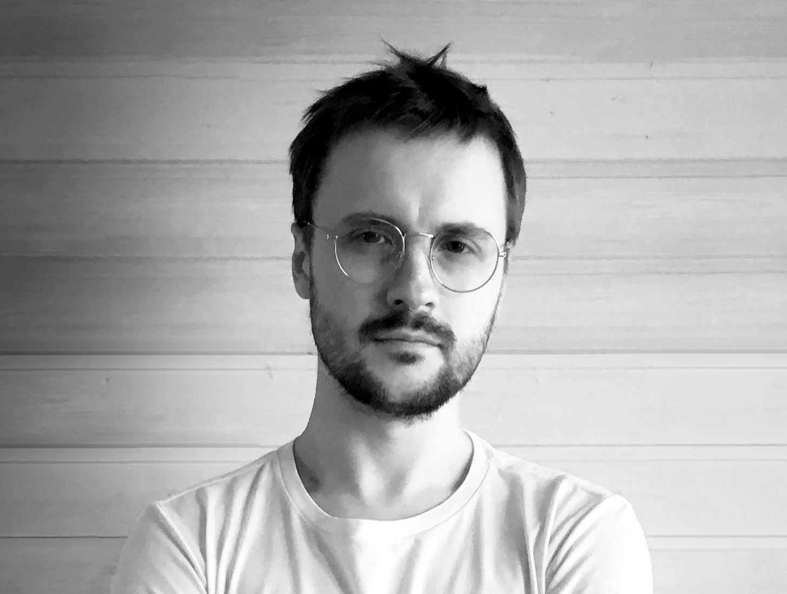

# CV

## Dmitrii Cherviakov

### Developer

Location: Turkey  
Citizenship: Russia   
Willing to relocate, willing to travel

**Contact Information:**  
+79858747450  
https://t.me/fonmusic  
dmitriimusique@gmail.com  
[LinkedIn Profile](https://www.linkedin.com/in/dmitriicherviakov/)  
[GitHub Profile](https://github.com/fonmusic)

**Work Schedule:** Full-time, remote

## **Work Experience:**

#### OOO "Snegiri-Musica" (January 2017 - Present)
_Department Head of Licensing_
- Licensing music for advertising and film
- Organizing music production for advertising and film

#### Individual Entrepreneur Dmitrii Alexandrovich Cherviakov (August 2014 - Present)
_Composer/Arranger_
- Working on creating musical compositions, arrangements, recording instrument parts
- Participation in music activities of bands/artists
- Creating music and sound design for video brands

#### OOO "Snegiri-Musica" (June 2015 - December 2016)
_Music Licensing Specialist_
- Licensing music for advertising and film

#### Ivanovo State University (January 2009 - March 2014)
_Head of Certification, Accreditation, and Licensing Department_
- Processing licenses for educational activities and undergoing accreditation procedures for educational programs

## **Education:**
- Bachelor's Degree (2008): Ivanovo State University, Ivanovo, Russia
  - Major: Jurisprudence

**Professional Development, Courses:**
- 2022: Unity Game Development, GeekBrains, Developer
- 2022: C# Developer, GeekBrains, Developer
- 2022: Reverse Engineering and Synthesis, XSSR Academy, Audio Designer
- 2021: Sound Design for Games and Videos, XSSR Academy, Sound Designer
- 2021: Interactive Sound and Audio Effects, XSSR Academy, Audio Designer
- 2021: Music Composition for Games and Videos, XSSR Academy, Composer

**Key Skills:**
- Programming Languages: C#
- Frameworks and Platforms: .NET, ASP.NET Core, Entity Framework, Angular, Unity
- Databases: SQLite, MS SQL Server
- Web Development: TypeScript, HTML, CSS
- Game Engines: Unity
- Docker and Containerization
- English Language (B2 level)

**Additional skills:**
- Bootstrap
- Java
- Swift
- Python
- Interactive Audio (Wwise, FMOD, REAPER)

**Additional Information:**

I am a developer with a focus on backend, web and game development. I have experience working on various projects, including web application development using `.NET` and `Angular`, game development using `Unity`, and development of class libraries. I have the ability to develop structured, modular, and efficient code, following OOP principles and best practices.

I am committed to continuous learning and improving my skills. I am quick to learn and adapt to new technologies and programming languages. I also have a keen interest in exploring new software and technologies. I have a broad range of interests beyond programming, and I believe that the best solutions and innovations arise at the intersection of different fields. In my hobbies, I deeply study architecture and history. I also have extensive experience in music, including both creation and rights management.

I am seeking an opportunity to apply my knowledge and experience in exciting projects, working with a team of dedicated professionals. I would be glad to contribute and help achieve success in software development.