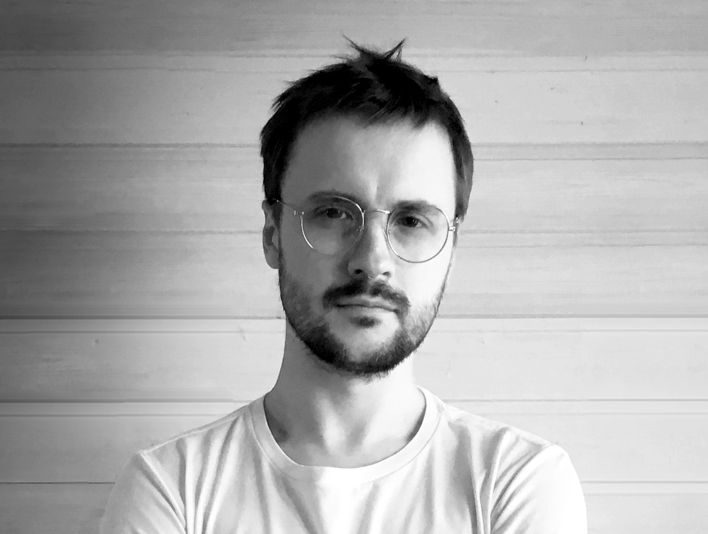

# Резюме

## Червяков Дмитрий Александрович 

### Разработчик

Место проживания: Турция  
Гражданство: Россия  
Готов к переезду

**Контактная информация:**  
+79858747450  
https://t.me/fonmusic   
dmitriimusique@gmail.com  
[Профиль на LinkedIn](https://www.linkedin.com/in/dmitriicherviakov/)  
[Профиль на GitHub](https://github.com/fonmusic)

**График работы:** Полный день, удаленная работа

## **Опыт работы:**

#### ООО "Снегири-музыка" (Январь 2017 - настоящее время)
_Руководитель отдела лицензирования_
- Лицензирование музыки для рекламы и кино
- Организация производства музыки для рекламы и кино

#### ИП Червяков Дмитрий Александрович (Август 2014 - настоящее время)
_Композитор/Аранжировщик_
- Работа над созданием музыкальных произведений, аранжировок, запись партий музыкальных инструментов
- Участие в музыкальной деятельности групп/артистов
- Создание музыки и саунд-дизайна для видео брендов

#### ООО "Снегири-музыка" (Июнь 2015 - Декабрь 2016)
_Специалист по лицензированию музыки_
- Лицензирование музыки для рекламы и кино

#### ИвГУ (Январь 2009 - Март 2014)
_Заведующий сектором аттестации, аккредитации, лицензирования_
- Оформление лицензий на право ведения образовательной деятельности и прохождение процедур аккредитации образовательных программ

## **Образование:**
- Высшее (2008): Ивановский государственный университет, Иваново (Ивановская область)
  - Специальность: Юриспруденция

**Повышение квалификации, курсы:**
- 2022: Разработка игр на Unity, GeekBrains, Разработчик
- 2022: Разработчик на C#, GeekBrains, Разработчик
- 2021: Реверс-инжиниринг и синтез, XSSR Academy, Аудиодизайнер
- 2020: Саунд-дизайн для игр и видео, XSSR Academy, Саунд-дизайнер
- 2020: Интерактивный звук и аудиодвижки, XSSR Academy, Аудиодизайнер
- 2020: Создание музыки для игр и видео, XSSR Academy, Композитор

**Ключевые навыки:**
- Языки программирования: C#
- Фреймворки и платформы: .NET, ASP.NET Core, Entity Framework, Angular, Unity
- Базы данных: SQLite, MS SQL Server
- Веб-разработка: TypeScript, HTML, CSS
- Игровые движки: Unity
- Docker и контейнеризация
- Английский язык (уровень B2)

**Дополнительные навыки:**
- Bootstrap
- Java
- Swift
- Python
- Interactive Audio (Wwise, FMOD, REAPER)

**Дополнительная информация:**

Я разработчик с фокусом на бекенд, веб и игровую разработку. 
У меня опыт работы над рядом проектов, включая разработку веб-приложений с использованием `.NET` и `Angular`, создание игр на `Unity`, а также разработку библиотеки классов. Я обладаю умением разрабатывать структурированный, модульный и эффективный код, следуя принципам ООП и лучшим практикам разработки.

Я стремлюсь к постоянному обучению и совершенствованию своих навыков. Я легко обучаем и адаптируюсь к новым технологиям и языкам программирования. Я также с большим увлечением изучаю новое программное обеспечение и технологии. У меня довольно широкий кругозор и интересы за пределами программирования, и я верю в то, что лучшие решения и инновации возникают на пересечении различных сфер. В моём хобби я глубоко изучаю архитектуру и историю. Также у меня большой опыт работы с музыкой, включая как её создание, так и управление правами на неё.

Я ищу возможность применить мои знания и опыт в увлекательных проектах, работая в команде целеустремлённых профессионалов. Буду рад внести свой вклад и помочь достичь успеха в разработке программного обеспечения.